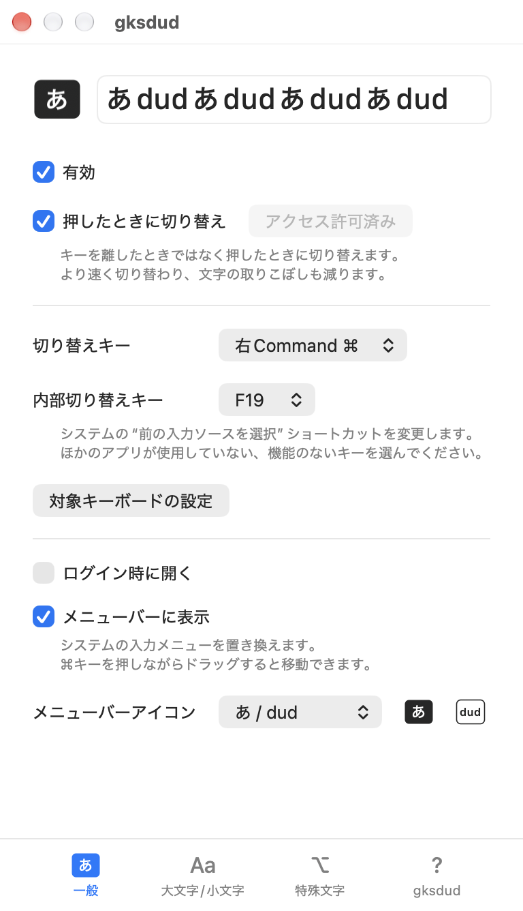
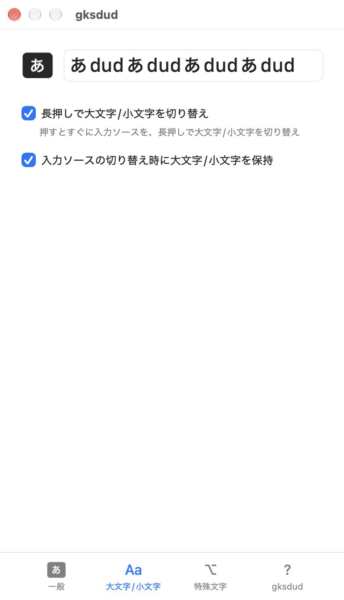
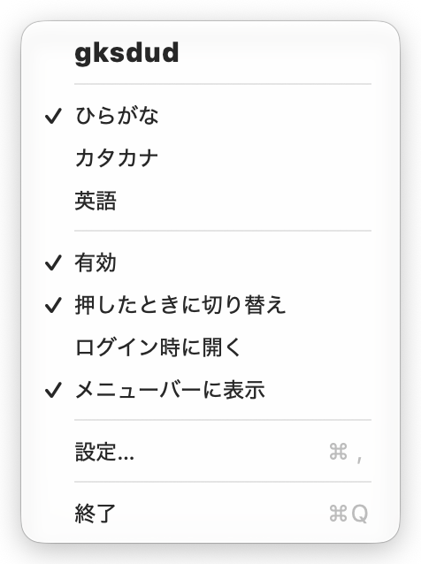
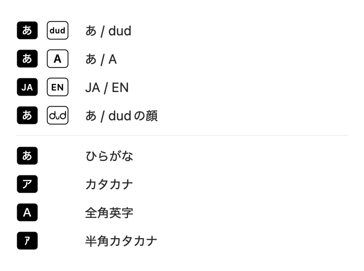
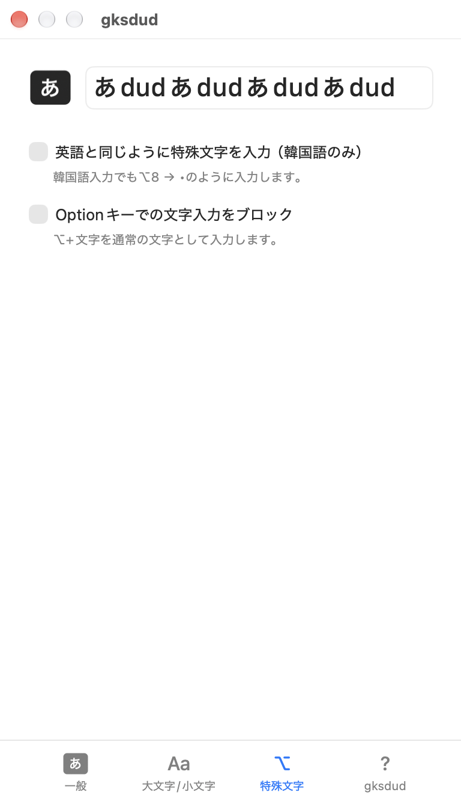

<!-- translated-from: README.md sha256=a779fde56f6b9373c66541b548d19625c55e9439dc6804a89ec48aac0e7760b8 -->

# gksdud - 取りこぼしのない、すばやい Mac の入力切り替え

[한국어](README.md) · **日本語** · [繁體中文](README.zh-Hant.md)

このドキュメントは韓国語の README を翻訳したものです。内容が異なる場合は、[韓国語版](README.md)が優先されます。


`Karabiner` も、複雑な設定もなしで

アプリひとつで**取りこぼしのない入力切り替え**を設定できるユーティリティ

gksdud という名前は、英語入力のままキーボードで「한영」（韓国語/英語）と打ったときに入力される文字列です。

## 主な機能



少し使うだけで違いがわかるほど、すばやく入力ソースが切り替わります。
- **切り替えキーの変更**: `右⌘` などのキーを選んで、切り替えキーとして使えます。
- **遅延と取りこぼしの改善**: 従来の方法で起きていた**遅延**、**文字の取りこぼし**、**切り替えの取りこぼし**のない切り替えを実現しています。



入力切り替えに遅延が出ない、新しい方式の長押しによる大文字/小文字の切り替え機能です。
- **切り替えキーの長押しで大文字/小文字を切り替え**: 従来の方式と違い、押した瞬間に入力ソースを切り替え、そのまま押し続けると大文字/小文字を切り替える方式なので、**遅延がありません**。
- **入力ソースの切り替え時に大文字/小文字を保持**: 英語で大文字を入力している状態から日本語などに切り替えても、英語に戻ると大文字のままです。

 

メニューバーにあるシステムの入力メニューのアイコンを置き換えて、スペースを節約します。アイコンのスタイルも変更できます。

gksdud のアイコンを表示している間は、システムの入力メニューが非表示になります。入力プログラムのメニュー項目を使うときなど、システムの入力メニューが必要な場合は、gksdud の「メニューバーに表示」をオフにしてください。gksdud のアイコンの代わりに、システムの入力メニューが表示されます。gksdud のメニューには有効になっているすべての入力ソースが表示され、選ぶとその入力ソースに切り替わります。



- **特殊文字の入力**: 韓国語入力のときも `⌥+文字` の特殊文字を英語と同じように入力したり、Option キーでの文字入力をブロックしたりできます。
  - 英語と同じように入力する機能は韓国語入力でのみ動作し、Option キーでの文字入力のブロックはすべての入力ソースで動作します。
- **多言語対応**: 日本語と繁体字中国語の表示に対応しています。メニューバーのアイコンと gksdud のメニューでは、日本語や中国語の入力ソースも区別して表示します。

## インストール

### ⚠️ 注意

現在は**自己署名**のため、初めて開くときに macOS がブロックすることがあります。

ブロックされた場合は、「システム設定」＞「プライバシーとセキュリティ」＞「セキュリティ」で「このまま開く」をクリックして、開くことを許可してください。

### A. Homebrew でインストール

```sh
brew install --cask codingnoye/tap/gksdud
```

### B. 手動でインストール

1. [リリースページ](https://github.com/codingnoye/gksdud/releases/latest)から ZIP アーカイブをダウンロードします。
2. ZIP アーカイブを展開し、中にある `gksdud.app` を**アプリケーション**フォルダに移動します。
3. アプリケーションフォルダから gksdud を開きます。

## 使い方

1. `gksdud` を開くと、メニューバーにアイコンが表示されます。
   1. システムの入力メニューのアイコンに似たアイコンを探してください。gksdud のアイコンが、システムの入力メニューのアイコンの代わりに表示されます。
   2. `⌘` キーを押しながらドラッグすると、アイコンの位置を移動できます。
2. より速く、取りこぼしなく切り替えるには、**アクセスを許可**をクリックしてアクセシビリティへのアクセスを許可したあと、**押したときに切り替え**をオンにします。
   - どちらも設定ウインドウの「一般」タブにあります。設定ウインドウは、gksdud のメニューで「設定…」を選ぶと開きます。
   - アクセスは、「システム設定」＞「プライバシーとセキュリティ」＞「アクセシビリティ」で gksdud をオンにして許可します。macOS 27 では、この項目は「デバイスの制御とデータへのアクセス」と表示されます。
3. 設定ウインドウ上部の入力欄で、日本語と英語を交互に入力して試してみてください。

## 仕組み

- **切り替えキーを F19 に変えます。** macOS のキーマッピング機能で、選んだ切り替えキーを `F19`（デフォルト）に割り当て、システムの「前の入力ソースを選択」ショートカットも `F19` に設定します。これにより、`Caps Lock` を使った切り替えの遅延を減らせます。ここまでは、従来の `Karabiner` とシステム設定を手動で変更する方法と同じです。
  - 「前の入力ソースを選択」は「システム設定」＞「キーボード」＞「キーボードショートカット…」＞「入力ソース」にあるショートカットで、直前に使っていた入力ソースに戻ります。そのため、切り替えキーは最近使った 2 つの入力ソースを交互に切り替えます。3 つ以上の入力ソースを有効にしている場合は、それ以外の入力ソースを gksdud のメニューから選びます。
- **押した瞬間に切り替えます。** 「押したときに切り替え」をオンにすると、切り替えキーを押した瞬間に `F19` キーを押して離すイベントを続けて発生させます。すばやく入力している途中で切り替えたときに、1 文字取りこぼすことがあった問題を改善します。
- **シンプルな実装。** 切り替えキーでは、入力ソースを直接切り替えたり、入力プログラムを置き換えたりはしません。設定が崩れにくいように、キーマッピングと切り替えイベントだけで動作するように実装しています。

## 日本語入力で使う

### バッジ

メニューバーのアイコンと gksdud のメニューには、入力ソースに合わせて次のバッジが表示されます。

| バッジ | 入力ソース |
| --- | --- |
| あ | ひらがな |
| ア | カタカナ |
| Ａ | 全角英字 |
| ｱ | 半角カタカナ |
| A | 英字・ABC など |

日本語のバッジは塗りつぶしで、英語のバッジは枠線だけで表示されます。英語のバッジは、アイコンのスタイルが「あ / A」のときは A、デフォルトの「あ / dud」のときは dud、「あ / dudの顔」のときは dud の顔のアイコンです。「JA / EN」のときは、日本語の入力ソースはすべて JA、英語の入力ソースは EN と表示されます。

### gksdud のメニュー

gksdud のメニューでは、1 つの言語で有効な入力ソースが 1 つだけなら「日本語」「英語」のように言語名で、複数あれば「ひらがな」「カタカナ」のように入力ソースの名前で表示されます。たとえば「ひらがな」「カタカナ」と ABC を有効にしている場合は、「ひらがな」「カタカナ」「英語」の順に表示されます。

「日本語 – ローマ字入力」と「日本語 – かな入力」のどちらでも使えます。両方を追加している場合は、「ひらがな (日本語 – ローマ字入力)」のように、同じ名前の入力ソースに入力プログラム名を添えて区別します。

### 入力ソースと切り替え

- 日本語入力の「英字」は英語の入力ソースとして扱われるため、「ひらがな」と「英字」を切り替えても英字の大文字/小文字の状態が保たれます（「入力ソースの切り替え時に大文字/小文字を保持」がオンの場合）。「全角英字」は日本語の入力ソースとして扱われます。
- JIS 配列キーボードの「英数」キーと「かな」キーは、これまでどおり使えます。gksdud は、US 配列キーボードを使う場合や、1 つのキーで切り替えたい場合に特に便利です。
- 切り替えキーに Caps Lock を選ぶと、gksdud は Caps Lock キーを内部切り替えキー（デフォルトは `F19`）に割り当てるため、Caps Lock キーを押しても大文字/小文字は切り替わらなくなります。大文字/小文字を切り替えるには、「長押しで大文字/小文字を切り替え」をオンにして切り替えキーを長押しします。

## 表示言語

gksdud は、macOS の「優先する言語」に従って日本語、繁体字中国語、韓国語のいずれかで表示されます。優先する言語にこれらが含まれていない場合や、まだ翻訳されていない文言は、韓国語で表示されます。gksdud だけ別の言語で表示するには、「システム設定」＞「一般」＞「言語と地域」＞「アプリケーション」で gksdud を追加して言語を選択します。リリースノートと、アプリ内に表示されるアップデートの概要は韓国語のみです。

## コントリビューション

開発環境、ビルド、検証の方法は[コントリビューションガイド](CONTRIBUTING.md)（韓国語）を参照してください。

## ライセンス

[MIT](LICENSE) ,  © 2026 CodingNoye ,  codingnoye@gmail.com
