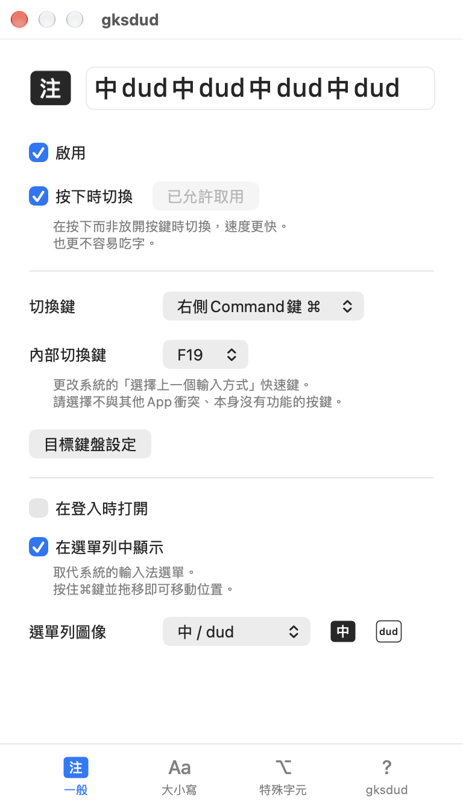
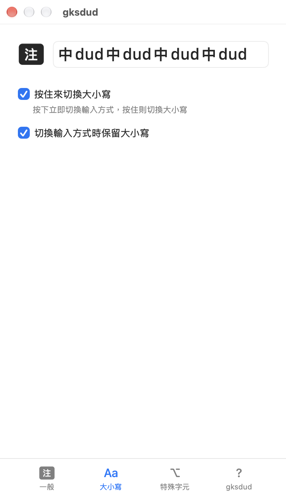
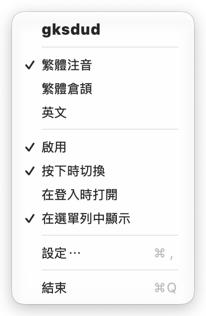
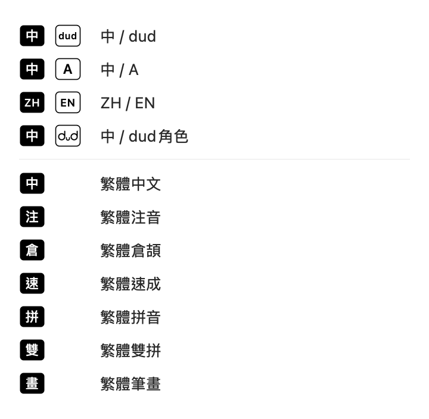
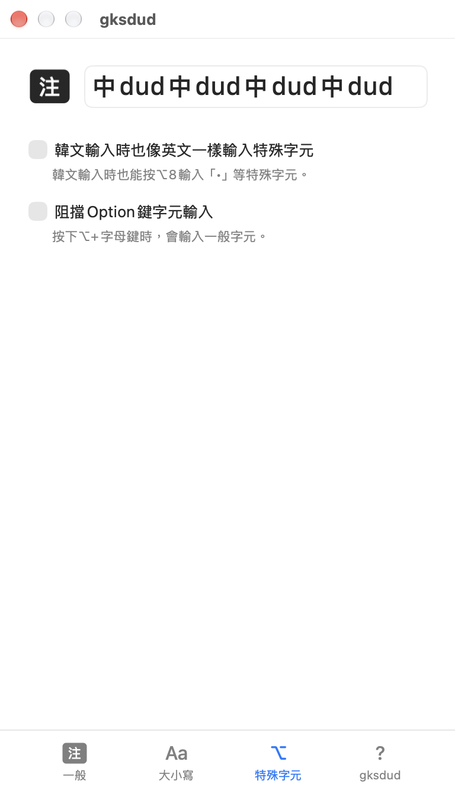

<!-- translated-from: README.md sha256=a779fde56f6b9373c66541b548d19625c55e9439dc6804a89ec48aac0e7760b8 -->

# gksdud - 不吃字、反應快的 Mac 中英切換

[한국어](README.md) · [日本語](README.ja.md) · **繁體中文**

本文件譯自韓文版 README，內容如有出入，以[韓文版](README.md)為準。


不需要 `Karabiner`，也不需要複雜的設定

只要一個 App，就能設定**不吃字的中英切換**

gksdud 這個名稱，是鍵盤仍在英文模式時打「한영」（韓／英）所得到的字母。

## 主要功能



中英切換反應快，稍微用一下就感覺得到。
- **更改切換鍵**：可選擇 `右側 ⌘` 等按鍵作為切換鍵
- **改善延遲與吃字**：切換時不會出現以往方法的**延遲**、**吃字**和**切換失靈**



採用新的大小寫切換方式：按住切換鍵即可切換大小寫，不會延遲中英切換。
- **按住切換鍵來切換大小寫**：和以往的方式不同，按下時會立即切換中英，繼續按住才切換大小寫，因此**沒有延遲**
- **中英切換時保留大小寫**：在英文大寫狀態下切換到中文，切回英文時仍維持大寫

 

取代選單列原本的輸入法圖像，節省空間。圖像樣式也可以更換。

gksdud 的圖像顯示在選單列時，系統的輸入法選單會隱藏，輸入法本身提供的選單項目也會一起隱藏。需要使用系統的輸入法選單時，請關閉 gksdud 的「在選單列中顯示」，選單列就會改為顯示系統的輸入法選單。gksdud 的選單會列出所有已啟用的輸入方式，選擇其中一項就會直接切換。



- **特殊字元輸入**：在韓文輸入時也能像英文一樣以 `⌥+字元` 輸入特殊字元；也可啟用「阻擋Option鍵字元輸入」，讓 `⌥+字母鍵` 輸入一般字元。
  - 像英文一樣輸入特殊字元的功能只適用於韓文輸入；阻擋 Option 鍵字元輸入則適用於所有輸入方式，但只作用於字母鍵。
- **多語言**：支援日文和繁體中文介面，選單列和 gksdud 的選單也會區分顯示日文和中文輸入方式

## 安裝

### ⚠️ 注意

目前 gksdud 採用**自行簽署**，macOS 可能會在第一次打開時阻擋它。

被阻擋後，請在「系統設定」>「隱私權與安全性」>「安全性」中按一下「強制打開」（香港：「私隱與保安」>「保安」>「強制開啟」）。

### A. 使用 Homebrew 安裝

```sh
brew install --cask codingnoye/tap/gksdud
```

### B. 手動安裝

1. 從 [Releases 頁面](https://github.com/codingnoye/gksdud/releases/latest) 下載 ZIP 封存檔。
2. 將 ZIP 封存檔解壓縮，再把其中的 `gksdud.app` 移到**應用程式**檔案夾。
3. 從「應用程式」檔案夾打開 gksdud。

## 使用方式

1. 打開 `gksdud` 後，選單列會出現它的圖像。
   1. 請找找看和原本輸入法圖像相似的圖像，它會取代原本的輸入法圖像。
   2. 可以用 `⌘+拖移` 移動位置。
2. 若要切換得更快、不吃字，請先按一下**允許「輔助使用」取用**並完成授權，再開啟**按下時切換**。
   - 這兩項都在設定視窗的「一般」標籤頁中。在 gksdud 的選單中選擇「設定⋯」，即可打開設定視窗。
   - 請在「系統設定」>「隱私權與安全性」（香港：「私隱與保安」）>「輔助使用」中開啟 gksdud 來完成授權。在 macOS 27 中，這個項目顯示為「裝置控制和資料取用」（香港：「裝置控制和資料取用權限」）。
3. 在設定視窗上方的文字欄位交替輸入中文和英文，測試看看。

## 運作方式

- **把切換鍵改成 F19。** 透過 macOS 的按鍵對應功能，把選擇的切換鍵對應到 `F19`（預設值），並將系統的「選擇上一個輸入方式」快速鍵（香港：「選擇上次的輸入方式」快捷鍵）也設為 `F19`。這樣可以減少以大寫鎖定鍵（`Caps Lock`）切換時的延遲。到這一步為止，都和以往用 `Karabiner` 再手動調整系統設定的做法相同。
  - 「選擇上一個輸入方式」是「系統設定」>「鍵盤」>「鍵盤快速鍵⋯」（香港：「鍵盤快捷鍵⋯」）>「輸入方式」中的快速鍵，會切回上一個使用的輸入方式，因此切換鍵會在最近使用的兩個輸入方式之間來回切換。啟用三個以上的輸入方式時，可從 gksdud 的選單選擇其他輸入方式。
- **一按下就切換。** 開啟「按下時切換」後，按下切換鍵的瞬間，gksdud 會連續送出 `F19` 的按下與放開事件，改善快速輸入中切換時會吃掉一個字的問題。
- **簡單的實作。** 切換鍵透過按鍵對應和系統快速鍵事件運作，不直接更改輸入方式，也不替換輸入法，以減少設定錯亂的問題。

## 搭配中文輸入方式使用

### 輸入方式圖像

選單列和 gksdud 的選單會依輸入方式顯示下列圖像：

| 圖像 | 輸入方式 |
| --- | --- |
| 注 | 注音（繁體注音、繁體倚天注音） |
| 倉 | 倉頡（繁體倉頡、粵語倉頡） |
| 速 | 速成（繁體速成、粵語速成） |
| 拼 | 拼音（繁體拼音） |
| 雙 | 雙拼（繁體雙拼） |
| 畫 | 筆畫（繁體筆畫、粵語筆畫） |
| 中 | 其他繁體中文輸入方式 |
| 粵 | 粵語拼音及其他粵語輸入方式 |

表中為台灣的輸入方式名稱。在香港，「繁體筆畫」「粵語拼音」「粵語倉頡」「粵語速成」「粵語筆畫」分別稱為「繁體筆劃」「廣東話拼音」「廣東話倉頡」「廣東話速成」「廣東話筆劃」。

中文輸入方式的圖像為實心，英文輸入方式的圖像只有外框。英文輸入方式在預設的「中 / dud」樣式中顯示 dud，在「中 / A」樣式中顯示 A。選擇「ZH / EN」這類代碼樣式時，繁體中文輸入方式一律顯示 ZH，粵語輸入方式顯示 YUE，英文輸入方式顯示 EN。簡體中文等 gksdud 沒有專屬圖像的輸入方式，會以外框圖像顯示語言代碼（例如 ZH），同樣會列在 gksdud 的選單中，可以直接選擇。

### gksdud 選單

在 gksdud 的選單中，同一種語言只啟用一個輸入方式時，以語言名稱顯示（例如「繁體中文」「英文」）；啟用多個時，則分別以輸入方式的名稱顯示（例如「繁體注音」「繁體倉頡」）。粵語輸入方式只啟用一個時，顯示為「繁體粵語」。例如啟用繁體注音、繁體倉頡、粵語拼音和 ABC 時，選單會依序顯示「繁體注音」「繁體倉頡」「繁體粵語」「英文」。

### 大寫鎖定鍵

macOS 內建的「使用大寫鎖定鍵來切換『ABC』及目前輸入方式」選項（香港：「使用大寫鎖定鍵來切換『ABC』及目前輸入法」）在切換時會有延遲。若在 gksdud 的「切換鍵」選擇「大寫鎖定 ⇪」，gksdud 會把大寫鎖定鍵對應到「內部切換鍵」（預設為 `F19`），因此按大寫鎖定鍵不會再切換大小寫；開啟「按下時切換」後，按下的瞬間就會切換輸入方式。若需要切換大小寫，可在「大小寫」標籤頁開啟「按住來切換大小寫」，再按住切換鍵。

## 介面語言

gksdud 的介面會依照 macOS 的「偏好的語言」或 App 個別的語言設定，以繁體中文、日文或韓文顯示。「偏好的語言」中沒有這三種語言時（例如只有簡體中文或英文），以及尚未翻譯的文字，都會以韓文顯示。若要單獨設定 gksdud 的語言，請在「系統設定」>「一般」>「語言與地區」>「應用程式」中加入 gksdud 並選擇語言。香港使用者看到的也是採用台灣用語的繁體中文介面。版本附註和 App 內的更新摘要只有韓文。

## 參與貢獻

開發環境、建置和驗證方式，請參閱[貢獻指南](CONTRIBUTING.md)（韓文）。

## 授權條款

[MIT](LICENSE) ,  © 2026 CodingNoye ,  codingnoye@gmail.com
